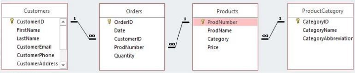
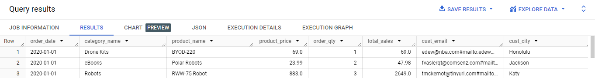
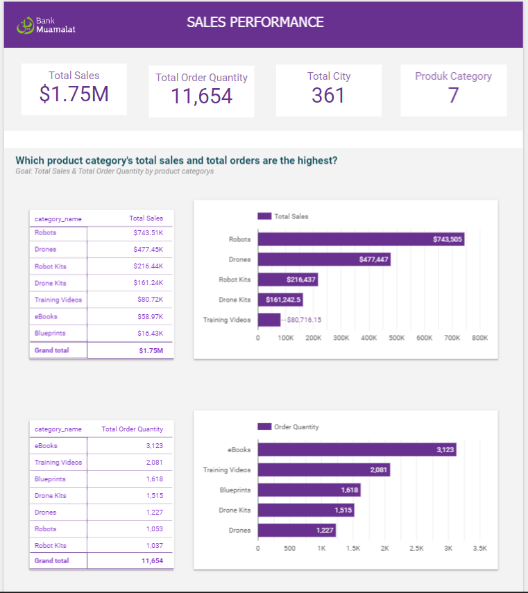
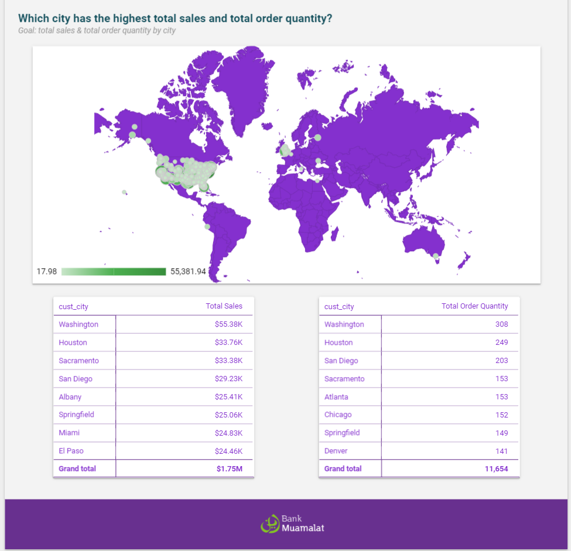

## 📂 **STAGE 1: Problem Statement**

### **Background Story**
Perusahaan **PT Sejahtera Bersama** ingin Melihat **Performa Penjualan (Pendapatan)**
dari berbagai kategori produk yang telah dipasarkan, Sebagai BI analyst saya diharapkan dapat
menganalisis topik sebagai berikut:
1. Total keseluruhan sales (Penjualan/Pendapatan)
2. Total keseluruhan sales (Penjualan/Pendapatan) berdasarkan kategori produk
3. Total keseluruhan qty berdasarkan kategori produk
4. Total sales (Penjualan/Pendapatan) berdasarkan kota
5. Total qty berdasarkan kota
6. Top 5 kategori produk yang paling tinggi salesnya
7. Top 5 kategori produk yang paling tinggi qtynya <br>
Dari hasil visualisasi akan diperoleh suatu insight dan rekomendasi untuk mempertahankan penjualan
ataupun menaikkan penjualan.
---

## 📂 **STAGE 2: Data Preparation**
**Tool: Google Big Query <br>**
### **Create Primary Key**
Langkah pertama yang dilakukan yaitu menentukan
primary key (nilai unik) dari masing masing dataset
(Table) yang telah diberikan, berikut keterangan
primary key untuk masing masing dataset:
1. Kolom “CustomerID” Sebagai Primary Key untuk
table Customers.
2. Kolom “OrderID” Sebagai Primary Key untuk
table Orders.
3. Kolom “ProdNumber” Sebagai Primary Key
untuk table Products.
4. Kolom “CategoryID” Sebagai Primary Key untuk
table PrroductCategory.
<br>

<details>
  <summary>Click untuk melihat Queries</summary>
  
  ```sql
#MEMBUAT PRIMARY KEY PADA MASING MASING TABLE
ALTER TABLE bank_muamalat.Customers ADD PRIMARY KEY (CustomerID) NOT ENFORCED;
ALTER TABLE bank_muamalat.Orders ADD PRIMARY KEY (OrderID) NOT ENFORCED;
ALTER TABLE bank_muamalat.Products ADD PRIMARY KEY (ProdNumber) NOT ENFORCED;
ALTER TABLE bank_muamalat.ProductCategory ADD PRIMARY KEY (CategoryID) NOT ENFORCED;
  ```
</details>

### **Create Foreign Key/Table Relationship**
Selanjutnya yaitu menentukan foreign key (kunci penghubung) dari masing masing dataset (Table) untuk
melakukan relasi/hubungan antar tabel, berikut keterangan dari Table Relationship:
1. Relasi Table Customers & Orders (CustomerID) memiliki hubungan one to many, yang artinya satu
customer dapat melakukan banyak pesanan (order).
2. Relasi Table Products & Orders (ProdNumber) memiliki hubungan one to many, yang artinya satu product
dapat dilakukan banyak pesanan (order).
3. Relasi Table Products & ProductCategory (Category & CategoryID) memiliki hubungan one to many, yang
artinya satu Kategori Produk dapat memiliki banyak Produk.

**Hasil Tabel Relasi :** <br>
<p align="center">
  <kbd> </kbd> <br>
  <strong> Gambar 1. Entity Relationship Diagram </strong>
</p>
<br>

<details>
  <summary>Click untuk melihat Queries</summary>
  
  ```sql
  # 2.MEMBUAT RELASI ANTAR TABLE
# Relasi Table Customers & Orders(CustomerID) memiliki hubungan one to many, yang artinya satu customer dapat melakukan banyak pesanan 
ALTER TABLE bank_muamalat.Orders 
ADD CONSTRAINT fk_CustomerID 
FOREIGN KEY (CustomerID) 
REFERENCES bank_muamalat.Customers(CustomerID) NOT ENFORCED;

#Relasi Table Products & Orders(ProdNumber) memiliki hubungan one to many, yang artinya satu product dapat dilakukan banyak pemesanan
ALTER TABLE bank_muamalat.Orders 
ADD CONSTRAINT fk_ProdNumber 
FOREIGN KEY (ProdNumber) 
REFERENCES bank_muamalat.Products(ProdNumber) NOT ENFORCED;

#Relasi Table Products & ProductCategory(Category & CategoryID) memiliki hubungan one to many, yang artinya satu Kategori Produk memiliki banyak Produk
ALTER TABLE bank_muamalat.Products
ADD CONSTRAINT fk_Category 
FOREIGN KEY (Category) 
REFERENCES bank_muamalat.ProductCategory(CategoryID) NOT ENFORCED;
  ```
</details>

### **Create Table Master**
Membuat table master dengan melakukan join antar table dan mengurutkannya berdasarkan order date awal dan
order qty terkecil untuk mendapatkan informasi atau kolom yang diperlukan dalam pembuatan dashboard
visualisasi.
**Hasil Tabel Relasi :** <br>
<p align="center">
  <kbd> </kbd> <br>
  <strong> Gambar 2. Mater Tabel </strong>
</p>
<br>
<details>
  <summary>Click untuk melihat Queries</summary>
  
  ```sql
#3.MEMBUAT TABLE MASTER
CREATE TABLE bank_muamalat.master_table AS
select o.Date as order_date,
       pc.CategoryName as category_name,
       p.ProdName as product_name,
       p.Price as product_price,
       o.Quantity as order_qty,
       p.Price * o.Quantity as total_sales,
       c.CustomerEmail as cust_email,
       c.CustomerCity as cust_city
from bank_muamalat.Orders as o
join bank_muamalat.Customers as c
on o.CustomerID = c.CustomerID
join bank_muamalat.Products as p
on o.ProdNumber = p.ProdNumber
join bank_muamalat.ProductCategory as pc
on p.Category = pc.CategoryID
order by 1, 5
 ```
</details>

---

## 📂 **STAGE 3: Data Visualization**
**Tool: Looker Studio <br>**
**Dashboard Link: https://lookerstudio.google.com/reporting/3997c2a7-0c1b-4c28-9005-15998f0bd634** <br>
**Hasil Visualisasi :** <br>
<p align="center">
  <kbd> </kbd> <br>
  <strong> Gambar 3. Top Penjualan (Pendapatan) dan Kuantitas Pemesanan berdasarkan Kategori Produk </strong>
</p>
<br>

- Hasil dari visualisasi dataset table master secara umum menunjukan total sales (penjualan) kurang lebih $1.75M (juta) dan total pemesanan secara kuantitas sebesar 11.654 terdiri dari 361 kota dan 7 Kategori Produk.
- Top 5 produk total sales (Penjualan), robot  memberikan  penghasilan tertinggi untuk  Perusahaan dengan total $743.505, diikuti drones, robot kits, drone kits, dan training videos. Sementara itu Top 5 produk total pemesanan secara kuantitas ebooks adalah yang 
paling banyak dibeli secara kuantitas dengan total 3.123 transaksi diikuti Training videos, Blueprint, Drone Kits dan Drone.
- secara penghasilan produk robot yang memberikan hasil yang besar namun secara quantity ebooks adalah yang paling laris.
  
**Hasil Visualisasi :** <br>
<p align="center">
  <kbd> </kbd> <br>
  <strong> Gambar 4. Total Penjualan (Pendapatan) dan Kuantitas Pemesanan berdasarkan Kota</strong>
</p>
<br>

- Secara keseluruhan kota penjualan tersebar di 3 benua yaitu Amerika, Eropa dan Australia. Dengan pusat distribusi penjualan terbanyak di amerika dan britania raya (united kingdom).
- Kota Washington menjadi pusat aktivitas transaksi utama dengan jumlah penjualan atau pendapatan sebesar $55.400.
- Kota Washington juga menjadi kota dengan jumlah quantity produk paling banyak terjual dengan total 308 unit namun masih terdapat  juga kota yang menghasilkan jumlah penjualan unit sangat kecil sehinga penjualan per-unitnya masih belum merata untuk setiap kota.

---

## 📂 **STAGE 4: Business Recomendation**
- Optimalkan Penjualan Produk Robot: Produk robot telah menjadi penyumbang pendapatan terbesar. Upayakan untuk memperluas pasar produk ini dengan strategi pemasaran yang lebih agresif, pengembangan fitur baru, atau bahkan kemitraan dengan pelaku industri terkait.
- Tingkatkan Penjualan Ebooks: Meskipun pendapatan dari ebooks tidak sebesar produk robot, Ebooks adalah produk yang paling banyak dibeli secara quantity dengan ini dapat memanfaatkan popularitas dengan menawarkan bundel atau diskon saat pembelian produk lain.
- Melakukan Pemerataan Penjualan Per Unit di Setiap Kota: Meskipun ada kota-kota dengan jumlah penjualan produk tertentu yang tinggi, ada juga kota dengan penjualan per unit yang rendah sehingga terjadi adanya ketimpangan penjualan per unit. Fokus pada strategi untuk meratakan dan meluaskan pasar penjualan per unit dengan menyesuaikan strategi seperti melakukan kampanye, pasar minat produk, kesesuaian harga, pemasaran, atau layanan tambahan lainnya.
- Mencoba strategi penjualan baru, seperti penjualan silang (cross-selling) dan penjualan tambahan (up-selling), untuk meningkatkan penjualan per quantity.
- Penjualan Silang (Cross-Selling) adalah strategi penjualan di mana penjual mencoba untuk menjual produk atau layanan tambahan yang terkait dengan produk yang sudah dibeli oleh pelanggan. Tujuannya adalah untuk meningkatkan nilai total penjualan kepada pelanggan. Contoh: Jika pelanggan membeli drone, Anda bisa menawarkan aksesori terkait seperti baterai tambahan atau tas khusus untuk drone.
- Penjualan Tambahan (Up-Selling) adalah strategi penjualan di mana penjual mencoba untuk menjual versi yang lebih mahal atau upgrade dari produk yang sedang dilihat atau dipilih oleh pelanggan. Tujuannya adalah untuk meningkatkan nilai total penjualan kepada pelanggan. Contoh: Jika pelanggan tertarik pada model dasar dari sebuah drone, Anda bisa menawarkan model yang lebih canggih dengan fitur tambahan seperti kamera resolusi tinggi atau waktu terbang yang lebih lama.


